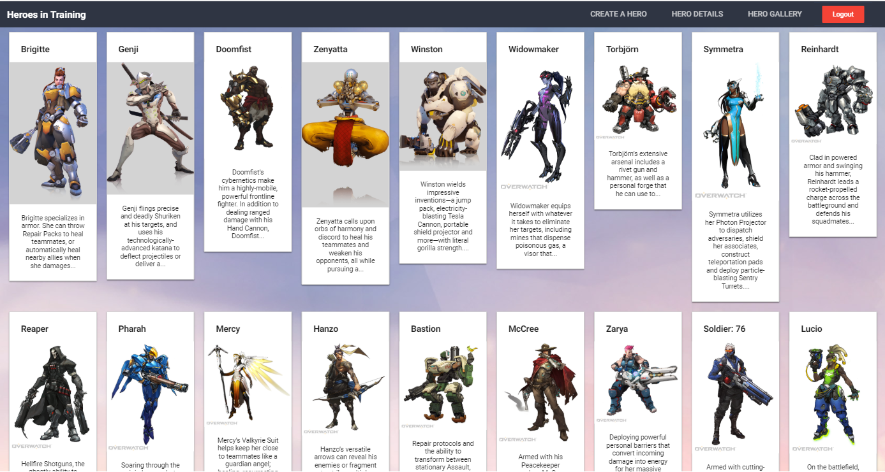

# Heroes In Training

A site where users can upload their Overwatch character designs to share with the world.

When creating an Overwatch character, uploading png images with transparent backgrounds looks best. Shown below.

  <h2>Without transparent background</h2>
  

  <h2>With transparent background</h2>
  

  <h2>Gallery Example</h2>
  

